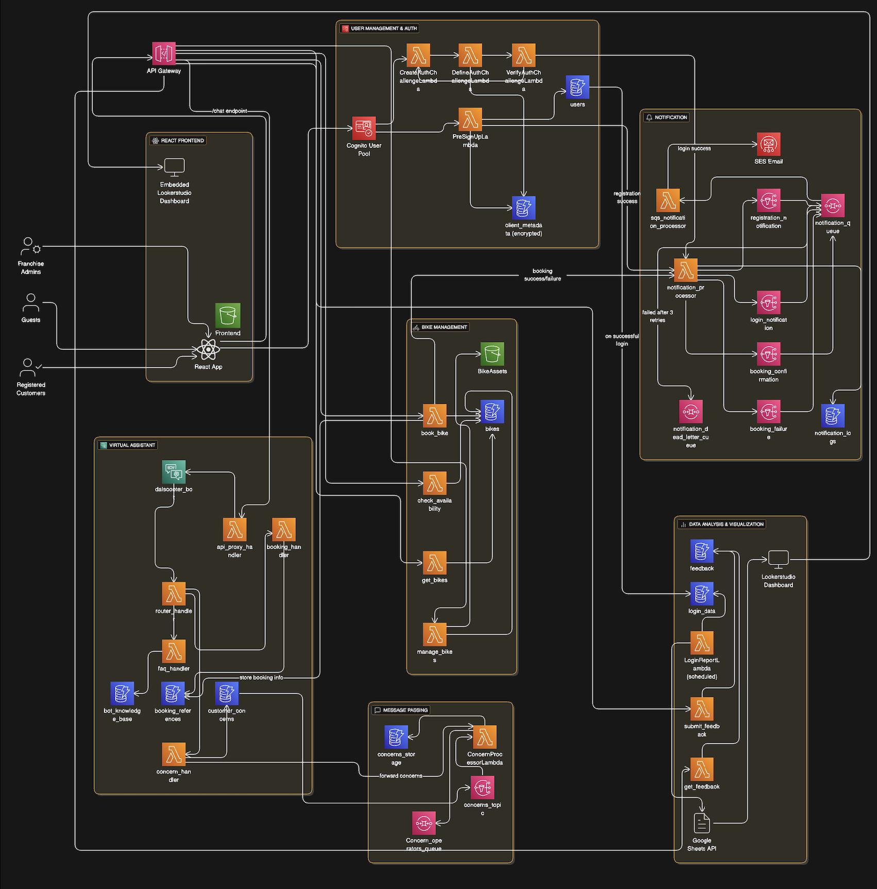

# DalScooter - Serverless Cloud Data Plumbing System

A comprehensive serverless application built using AWS services and Terraform for Infrastructure as Code (IaC). DalScooter is a multi-user bike rental platform supporting Guests, Registered Customers, and Franchise Admins with features including multi-factor authentication, virtual assistant, message passing, and data visualization.

## Table of Contents
- [Project Overview](#project-overview)
- [System Architecture](#system-architecture)
- [User Types & Features](#user-types--features)
- [Technology Stack](#technology-stack)
- [Project Structure](#project-structure)
- [Prerequisites](#prerequisites)
- [Installation & Deployment](#installation--deployment)
- [Module Implementation Details](#module-implementation-details)
- [Frontend Integration](#frontend-integration)
- [API Endpoints](#api-endpoints)
- [Testing](#testing)
- [Contributing](#contributing)
- [License](#license)

## Project Overview

DalScooter is a serverless bike rental application that demonstrates cloud-native architecture using AWS services. The system processes on-demand data without requiring specialist knowledge for operation, making it accessible for multiple clients.

### Key Features
- **Multi-Factor Authentication**: 3-factor authentication using Cognito, DynamoDB, and Caesar cipher
- **Virtual Assistant**: AWS Lex-powered chatbot for navigation and support
- **Message Passing**: Asynchronous communication between customers and franchise operators
- **Data Visualization**: Real-time analytics dashboard using Looker Studio
- **Bike Management**: CRUD operations for bike inventory and bookings
- **Notification System**: Email notifications for registration, login, and booking confirmations

## System Architecture

<!-- Architecture Diagram Placeholder -->


The system follows a serverless architecture pattern with the following key components:
- **Frontend**: React application hosted on AWS S3
- **API Gateway**: Central routing for all API requests
- **Authentication**: AWS Cognito with custom Lambda triggers
- **Virtual Assistant**: AWS Lex with multiple Lambda handlers
- **Message Passing**: AWS SNS/SQS for asynchronous communication
- **Data Storage**: Multiple DynamoDB tables for different data types
- **Notifications**: AWS SES with SNS/SQS orchestration
- **Analytics**: Looker Studio dashboard with Google Sheets API integration

## User Types & Features

### Guest Users
- Browse bike availability and tariffs (Gyroscooter, eBikes, Segway)
- Use virtual assistant for basic navigation
- View feedback and sentiment analysis for bikes

### Registered Customers
- All guest features plus:
- Multi-factor authentication (Username/Password, Q&A, Caesar cipher)
- Bike reservation with time slots
- Submit feedback and concerns
- Receive email notifications
- Communicate with franchise operators

### Franchise Admins
- All customer features plus:
- Add/update bike inventory and features
- Manage rental rates and discount codes
- View admin dashboard with user statistics
- Handle customer concerns and tickets
- Access comprehensive analytics

## Technology Stack

### AWS Services
- **Compute**: AWS Lambda
- **Authentication**: AWS Cognito
- **API Management**: AWS API Gateway
- **Storage**: AWS DynamoDB, AWS S3
- **Messaging**: AWS SNS, AWS SQS
- **Email**: AWS SES
- **AI/ML**: AWS Lex

### Development Tools
- **Infrastructure**: Terraform
- **Frontend**: React.js
- **Analytics**: Google Sheets API, Looker Studio
- **Version Control**: Git

## Project Structure

```
DalScooter/
├── modules/
│   ├── user_management_auth/
│   │   ├── main.tf
│   │   ├── variables.tf
│   │   ├── outputs.tf
│   │   └── lambda_functions/
│   ├── virtual_assistant/
│   │   ├── main.tf
│   │   ├── variables.tf
│   │   ├── outputs.tf
│   │   └── lambda_functions/
│   ├── message_passing/
│   │   ├── main.tf
│   │   ├── variables.tf
│   │   ├── outputs.tf
│   │   └── lambda_functions/
│   ├── notification/
│   │   ├── main.tf
│   │   ├── variables.tf
│   │   ├── outputs.tf
│   │   └── lambda_functions/
│   ├── data_analysis_visualization/
│   │   ├── main.tf
│   │   ├── variables.tf
│   │   ├── outputs.tf
│   │   └── lambda_functions/
│   ├── bike_management/
│   │   ├── main.tf
│   │   ├── variables.tf
│   │   ├── outputs.tf
│   │   └── lambda_functions/
│   └── web_deployment/
│       ├── main.tf
│       ├── variables.tf
│       └── outputs.tf
├── main.tf
├── variables.tf
├── outputs.tf
├── terraform.tfvars.example
├── frontend/
│   ├── src/
│   ├── public/
│   ├── package.json
│   └── README.md
└── README.md
```

## Prerequisites

- AWS CLI configured with appropriate permissions
- Terraform >= 1.0
- Node.js >= 16.x
- npm or yarn
- Google Cloud Console access (for Sheets API)
- Git

### AWS Permissions Required
- IAM, Lambda, API Gateway, Cognito, DynamoDB, S3, SNS, SQS, SES, Lex
- CloudWatch (for logging)

## Installation & Deployment

### Step 1: Clone the Repository
```bash
git clone https://github.com/malav2310/DalScooter.git
cd DalScooter
```

### Step 2: Configure AWS Credentials
```bash
aws configure
# Enter your AWS Access Key ID, Secret Access Key, Region, and Output format
```

### Step 3: Initialize and Deploy Infrastructure
```bash
# Initialize Terraform
terraform init

# Plan the deployment
terraform plan

# Apply the configuration
terraform apply
# Type 'yes' when prompted
```

### Step 4: Configure Google Sheets API (for Data Visualization)
1. Create a Google Cloud Project
2. Enable Google Sheets API
3. Create service account credentials
4. Update Lambda environment variables with credentials

### Step 5: Deploy Frontend Application
```bash
cd frontend

# Install dependencies
npm install

# Build the application
npm run build

# The build files will be automatically deployed to S3 via Terraform
```

### Step 6: Post-Deployment Configuration
1. **AWS SNS**: Subscribe to topic and Verify email addresses for notifications
2. **Cognito**: Configure user pool settings if needed
3. **Lex Bot**: Build bot, attach router lambda to it, test and refine bot responses
4. **Looker Studio**: Create and embed dashboard

## Module Implementation Details

### 1. User Management & Authentication Module
- **Components**: Cognito User Pool, Lambda triggers, DynamoDB tables
- **Features**: 3-factor authentication, user registration, profile management
- **Flow**: Registration → Email verification → Multi-factor login → Session management

### 2. Virtual Assistant Module
- **Components**: AWS Lex bot, multiple Lambda handlers, DynamoDB knowledge base
- **Features**: FAQ responses, booking queries, concern submission
- **Flow**: User input → Intent recognition → Handler routing → Response generation

### 3. Message Passing Module
- **Components**: SNS topics, SQS queues, Lambda processors
- **Features**: Asynchronous customer-operator communication
- **Flow**: Concern submission → SNS publish → SQS queue → Operator notification

### 4. Notification Module
- **Components**: SES, SNS, SQS, Lambda processors
- **Features**: Registration, login, booking confirmations
- **Flow**: Event trigger → SNS publish → SQS processing → Email delivery

### 5. Data Analysis & Visualization Module
- **Components**: DynamoDB, Lambda, Google Sheets API, Looker Studio
- **Features**: User analytics, feedback sentiment analysis
- **Flow**: Data collection → Processing → Google Sheets → Dashboard visualization

### 6. Bike Management Module
- **Components**: DynamoDB, Lambda functions, S3 storage
- **Features**: Bike CRUD operations, booking management, availability checking
- **Flow**: User request → Lambda processing → Database operations → Response

## Frontend Integration

After successfully deploying the Terraform infrastructure:

### 1. Update Frontend Configuration
```javascript
// src/config/aws-config.js
export const awsConfig = {
  region: 'your-aws-region',
  userPoolId: 'your-cognito-user-pool-id',
  userPoolWebClientId: 'your-cognito-client-id',
  apiGatewayUrl: 'your-api-gateway-url',
  // Add other configuration from Terraform outputs
};
```

### 2. Install Frontend Dependencies
```bash
cd frontend
npm install
```

### 3. Build and Deploy
```bash
npm run build
# Files are automatically synced to S3 bucket via Terraform
```

### 4. Access the Application
- Navigate to your S3 bucket's static website URL
- Or use CloudFront distribution URL if configured

## API Endpoints

### Authentication
- `POST /auth/register` - User registration
- `POST /auth/login` - User login
- `POST /auth/logout` - User logout

### Bike Management
- `GET /bikes` - List available bikes
- `POST /bikes` - Add new bike (Admin only)
- `PUT /bikes/{id}` - Update bike details (Admin only)
- `DELETE /bikes/{id}` - Remove bike (Admin only)
- `POST /bikes/{id}/book` - Book a bike

### Virtual Assistant
- `POST /chat` - Chat with virtual assistant

### Feedback
- `POST /feedback` - Submit feedback
- `GET /feedback` - Get all feedback

### Analytics (Admin only)
- `GET /analytics/users` - User statistics
- `GET /analytics/bookings` - Booking statistics

## Testing

### Unit Testing
```bash
# Run backend tests
cd modules/{module-name}
python -m pytest tests/

# Run frontend tests
cd frontend
npm test
```

### Integration Testing
```bash
# Test API endpoints
curl -X POST https://your-api-gateway-url/auth/register \
  -H "Content-Type: application/json" \
  -d '{"username":"test","email":"test@example.com","password":"Test123!"}'
```

### Load Testing
- Use AWS X-Ray for distributed tracing
- Monitor CloudWatch metrics for performance
- Test virtual assistant with various inputs

## Monitoring & Logging

- **CloudWatch Logs**: All Lambda functions log to CloudWatch
- **X-Ray Tracing**: Distributed tracing enabled
- **CloudWatch Metrics**: Custom metrics for business KPIs
- **DynamoDB Metrics**: Table performance monitoring

## Security Considerations

- **IAM Roles**: Principle of least privilege
- **VPC**: (Optional) Deploy Lambda in VPC for enhanced security
- **Encryption**: Data encrypted at rest and in transit
- **Input Validation**: All inputs validated and sanitized
- **Rate Limiting**: API Gateway throttling enabled

## Scalability Features

- **Auto Scaling**: Lambda functions scale automatically
- **DynamoDB**: On-demand billing and auto-scaling
- **API Gateway**: Handles high-volume requests
- **SQS**: Message queue for handling spikes

## Contributing

1. Fork the repository
2. Create a feature branch (`git checkout -b feature/AmazingFeature`)
3. Commit your changes (`git commit -m 'Add some AmazingFeature'`)
4. Push to the branch (`git push origin feature/AmazingFeature`)
5. Open a Pull Request

## License

This project is part of the Serverless Data Processing Course (CSCI 5410) at Dalhousie University. All rights reserved.

## Team Members

- Malav Shah
- Preet Patel  
- John Birdwell
- Navya Upalauri

## Support

For support or questions, please contact:
- Email: 45preet2001@gmail.com
- Repository: https://github.com/malav2310/DalScooter

---

**Note**: This project was developed as part of CSCI 5410 coursework. Please refer to the course guidelines for academic integrity policies.